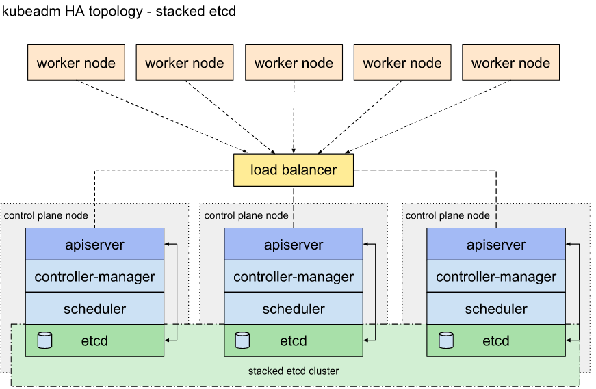
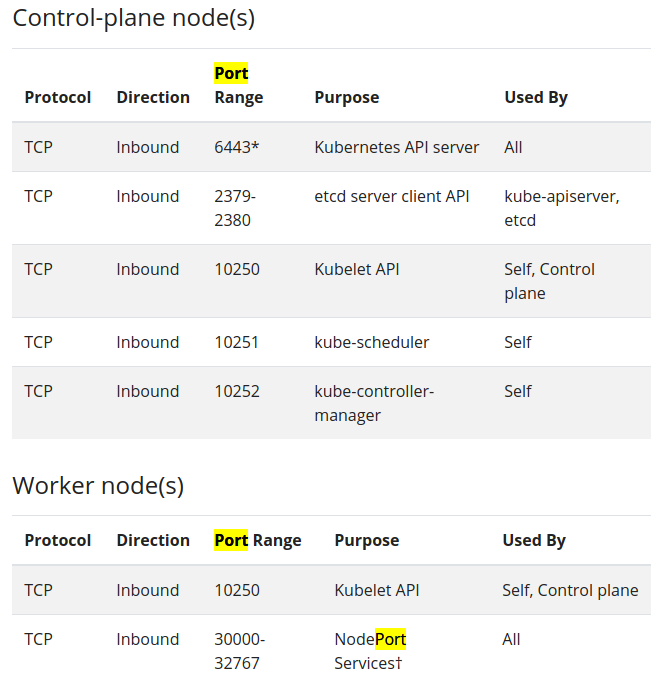

# Kubernetes 학습 환경 배포

## 환경 구성 설명

- 구성하려고 하는 k8s 학습 환경은 HA 구성을 위한 Master Node 3대와 Worker Node 2대로 구성되어 있습니다.
- 가상 머신을 통해 구성되며 인터페이스는 NAT (default) + Bridge Interface 를 사용합니다.
- 지속적으로 특정 노드에 많은 트래픽이 발생하는 경우 부하로 인해 Node 가 고장날 수 있어 부하 분산을 위한 LoadBalancer (HAProxy) 를 사용하여 Master Node 에 걸리는 부하를 분산시켜주었습니다.



## 초기 작업

- 1. hostname 설정
- 2. CRI (Docker) 설치
- 3. 방화벽 설정
- 4. iptables 설정
- 5. SELinux 해제
- 6. Swap Off

### hostname 설정

```shell
# vi /etc/hosts

172.30.1.11 master1
172.30.1.12 master2
172.30.1.13 master3
```

- 가상 머신 배포시 Vagrantfile 에서 config.vm.hostname 으로 설정한 값이 적용되기 때문에 해당 값으로 hosts 파일을 작성해주시면 됩니다.

### CRI (Docker) 설치

```shell
# vi docker-install.sh

#! /bin/bash
yum -y install yum-utils device-mapper-persistent-data lvm2
yum-config-manager --add-repo \
https://download.docker.com/linux/centos/docker-ce.repo
yum -y install docker-ce docker-ce-cli containerd.io
systemctl start docker && systemctl enable docker


# 실행 권한
chmod +x docker-install.sh

# 스크립트 실행
sh docker-install.sh

# 간단한 docker 명령어로 설치되었는지 확인
docker ps
docker version
```

- 최신 버전 기준 Docker 설치

### 방화벽 설정



- k8s Master, Worker Node 별 방화벽 설정

```shell
for port in 6443 2379-2380 6783 6784 10250-10252 26443
do
 firewall-cmd --add-port=$port/tcp --permanent
done

firewall-cmd --reload

# Check
firewall-cmd --list-all
public (active)
..
..
  services: dhcpv6-client dns http ssh
  ports: 6443/tcp 2379-2380/tcp 10250-10252/tcp 6783/tcp 6784/tcp 26443/tcp
..
```

### iptables 설정

```shell
cat <<EOF >  /etc/sysctl.d/k8s.conf
net.bridge.bridge-nf-call-ip6tables = 1
net.bridge.bridge-nf-call-iptables = 1
EOF

sysctl --system
```

- net.bridge.bridge-nf-call-iptables = 1 이 의미하는 바는 bridge 네트워크를 통해 송수신 되는 패킷이 iptables 설정을 우회한다는 의미입니다.

### SELinux 해제

```shell
# Permissive Mode로 변경 (재부팅 되면 다시 돌아옴)
setenforce 0

# selinux 설정 파일에서 영구 설정
sed -i 's/^SELINUX=enforcing$/SELINUX=permissive/' /etc/selinux/config
```

- 보안 설정 SELinux 를 종료합니다.

### Swap Off

```shell
swapoff -a

# swap이 들어간 Line 주석 처리
vi /etc/fstab
#/dev/mapper/centos-swap swap                    swap    defaults        0 0

```

- Swap 메모리 영역이 켜져있을 경우 가상화 관련된 작업 진행시 충돌이 발생할 수 있습니다.

## kubeadm 으로 Master Node 설치

- 1. kubelet, kubeadm, kubectl 설치
- 2. HAProxy 설치 및 설정 - Master 1 Node 에서만
- 3. Clustering 작업
- 4. CNI 적용 (Calico)

### kubelet, kubeadm, kubectl 설치

```shell
# apt-get update && apt-get install -y apt-transport-https curl
# curl -s https://packages.cloud.google.com/apt/doc/apt-key.gpg | apt-key add -
# echo deb http://apt.kubernetes.io/ kubernetes-xenial main > /etc/apt/sources.list.d/kubernetes.list
# apt-get update && apt-get install -y kubelet=1.22.9-00 kubeadm=1.22.9-00 kubectl=1.22.9-00

# systemctl enable kubelet && systemctl start kubelet
```

- k8s apt key 등록 후 k8s 설치

### HAProxy 설치 및 설정 - Master 1 Node 에서만

```shell
# apt-get install haproxy - y

# cat <<EOF >> /etc/haproxy/haproxy.cfg
frontend kubernetes-master-lb
bind 0.0.0.0:26443
option tcplog
mode tcp
default_backend kubernetes-master-nodes

backend kubernetes-master-nodes
mode tcp
balance roundrobin
option tcp-check
option tcplog
server master1 172.30.1.11:6443 check
server master2 172.30.1.12:6443 check
server master3 172.30.1.13:6443 check
EOF

# systemctl restart haproxy && systemctl enable haproxy

# systemctl status haproxy

# netstat -nltp | grep 26443
tcp        0      0 0.0.0.0:26443           0.0.0.0:*               LISTEN      2897/haproxy
```

- Master Node Clustering 을 위한 HAProxy 설치

### Clustering 작업

```
# kubeadm init --control-plane-endpoint "172.30.1.11:26443" --upload-certs --pod-network-cidr "192.168.0.0/16"

..
..
..

## 아래 출력물은 특정한 곳에 복붙 해놓을 것

Your Kubernetes control-plane has initialized successfully!

To start using your cluster, you need to run the following as a regular user:

  mkdir -p $HOME/.kube
  sudo cp -i /etc/kubernetes/admin.conf $HOME/.kube/config
  sudo chown $(id -u):$(id -g) $HOME/.kube/config

You should now deploy a pod network to the cluster.
Run "kubectl apply -f [podnetwork].yaml" with one of the options listed at:
  https://kubernetes.io/docs/concepts/cluster-administration/addons/

You can now join any number of the control-plane node running the following command on each as root:

  kubeadm join 192.168.100.10:26443 --token t69wl1.6iq2xfgp8thiz9bb \
    --discovery-token-ca-cert-hash sha256:b94dc94f3a249c237f39808a6ff2d1f68cbe058b9d4aef6d54173b5523976238 \
    --control-plane --certificate-key 91295ae74b07d78d46b4bdc29e62615d50b5644a97ff6f4453c39a574c1f9bb6

Please note that the certificate-key gives access to cluster sensitive data, keep it secret!
As a safeguard, uploaded-certs will be deleted in two hours; If necessary, you can use
"kubeadm init phase upload-certs --upload-certs" to reload certs afterward.

Then you can join any number of worker nodes by running the following on each as root:

kubeadm join 192.168.100.10:26443 --token t69wl1.6iq2xfgp8thiz9bb \
    --discovery-token-ca-cert-hash sha256:b94dc94f3a249c237f39808a6ff2d1f68cbe058b9d4aef6d54173b5523976238
```

- kubectl 명령어 권한 활성화를 위해 mkdir ~ 명령어 실행
- Master 2, 3 Node 에서 kubeadm join ~ 명령어 실행

### CNI 적용 (Calico)

```shell
$ curl https://projectcalico.docs.tigera.io/manifests/calico.yaml -O

$ kubectl apply -f calico.yaml
```

- CNI 설치 및 적용

```shell
vagrant@kube-control1:~$ kubectl get pods -n kube-system
NAME                                       READY   STATUS    RESTARTS      AGE
calico-kube-controllers-5b5b79df9b-r2mqr   1/1     Running   0             26h
calico-node-29287                          1/1     Running   0             26h
calico-node-gg98w                          1/1     Running   0             26h
calico-node-pbkjs                          1/1     Running   0             25h
calico-node-qkb8p                          1/1     Running   0             26h
calico-node-xqgp6                          1/1     Running   0             25h
coredns-78fcd69978-75crp                   1/1     Running   0             26h
coredns-78fcd69978-hzm4x                   1/1     Running   0             26h
etcd-kube-control1                         1/1     Running   1             26h
etcd-kube-control2                         1/1     Running   0             26h
etcd-kube-control3                         1/1     Running   0             26h
kube-apiserver-kube-control1               1/1     Running   1             26h
kube-apiserver-kube-control2               1/1     Running   0             26h
kube-apiserver-kube-control3               1/1     Running   0             26h
kube-controller-manager-kube-control1      1/1     Running   2 (26h ago)   26h
kube-controller-manager-kube-control2      1/1     Running   0             26h
kube-controller-manager-kube-control3      1/1     Running   0             26h
kube-proxy-9zblp                           1/1     Running   0             26h
kube-proxy-klxh9                           1/1     Running   0             26h
kube-proxy-tfwvn                           1/1     Running   0             26h
kube-proxy-w9lp9                           1/1     Running   0             25h
kube-proxy-zmv44                           1/1     Running   0             25h
kube-scheduler-kube-control1               1/1     Running   2 (26h ago)   26h
kube-scheduler-kube-control2               1/1     Running   0             26h
kube-scheduler-kube-control3               1/1     Running   0             26h

vagrant@kube-control1:~$ kubectl get nodes
NAME            STATUS   ROLES                  AGE   VERSION
kube-control1   Ready    control-plane,master   26h   v1.22.9
kube-control2   Ready    control-plane,master   26h   v1.22.9
kube-control3   Ready    control-plane,master   26h   v1.22.9

```

- 각 Master Node 별 k8s pods 및 node 상태 확인

# Reference

[1] [Kubernetes] kubeadm Master 3개 설정 (Haproxy), https://velog.io/@pingping95/Kubernetes-kubeadm-Master-%EA%B3%A0%EA%B0%80%EC%9A%A9%EC%84%B1
[2] Install Calico networking and network policy for on-premises deployments
, https://projectcalico.docs.tigera.io/getting-started/kubernetes/self-managed-onprem/onpremises
